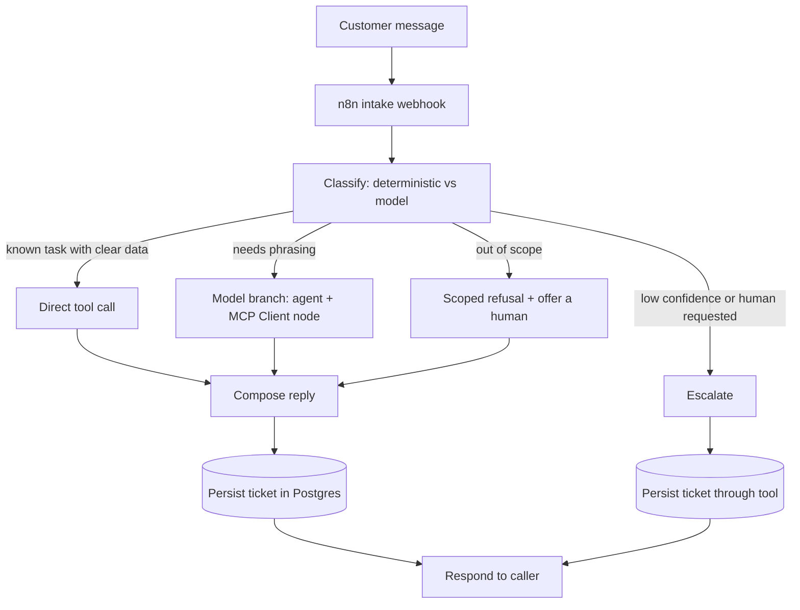

# Architecture

This kit answers customer questions for a Shopify store inside a tightly scoped
set of business tasks: order status, returns and refunds, shipping, store FAQ,
and booking. Clear single-topic requests use deterministic tools instead of a
paid model, and anything outside the supported tasks is politely
declined instead of answered freely.

## Components

| Component | Role | Technology |
|-----------|------|------------|
| n8n | Orchestration. Receives a message, classifies it, calls tools, replies, and records the ticket. | Self-hosted n8n |
| Tool service | Deterministic business logic exposed two ways: an MCP server for the n8n MCP Client node, and a plain REST facade for direct use and tests. | Node.js + TypeScript |
| Postgres | Durable storage for tickets and the answer cache. | Postgres 16 |
| Mock Shopify adapter | Reads orders and products from local JSON so the whole kit runs offline with no store credentials. | In-process module |
| Mock LLM | Deterministic, grounded, OpenAI-compatible stand in so the kit runs offline with no API key and no paid calls. | In-process module |

Everything ships with mock adapters, so the default runtime makes no external
API calls once dependencies and container images are installed. The direct
service does not include production commerce or model adapters; adding them
requires implementation and integration testing.

## Request flow

### Classification

A deterministic classifier runs first. It detects intent from keywords and
extracts entities such as an order number or email. The outcome is a `route`:

- `deterministic`: the intent maps cleanly to store data, for example an order
  status lookup or a known FAQ. The tool service answers from data and a
  template. No model is called, so this path is effectively free.
- `model`: the message is in scope but needs natural language synthesis. The
  model is called with a strict, grounded prompt and is instructed to use only
  tool output.
- `escalate`: low confidence, an explicit request for a human, or a failed
  lookup. A ticket is opened and assigned to a support queue. Notification
  delivery is a production integration task.
- `out_of_scope`: the message is not one of the supported tasks. The kit
  declines and offers to connect a human, rather than acting as a general
  chatbot.

### Tools

The tool service exposes four tools backed by the mock adapters:

- `order_lookup`: order status, fulfillment, and tracking for an order id or
  email.
- `faq_retrieval`: ranked answers from the store FAQ corpus (returns, shipping,
  sizing, warranty, and similar).
- `escalate`: opens a ticket and assigns it to the configured human queue.
- `check_booking`: returns available slots for a consultation or fitting.

The same functions are reachable two ways. The n8n MCP Client node talks to the
MCP server for the model-driven branch, and the deterministic branch calls the
REST facade directly. Both call the identical underlying functions, so behavior
is consistent regardless of entry point.

### Cost control

The direct `POST /support` pipeline checks the answer cache first. The cache key
is a hash of the normalized message and route. A hit returns the stored answer
and skips the model call entirely. Deterministic answers are also cached for
consistency. Cache entries use the configured persistence store. The imported
workflow's model branch does not currently call this cache.

### Error workflow

An error workflow is included, but imported workflows do not select it
automatically. An operator must choose it in the intake workflow settings. It
captures failure details and posts them to the tool service when that reporting
path is available.

## Why scoped, not a general chatbot

Scoped routing reduces off-topic behavior and keeps deterministic tasks away
from the model. It does not by itself establish compliance. Review current
channel policies, privacy rules, and the behavior of any production model
before deployment.

## Configuration and secrets

Runtime configuration lives in `config.json`, which is git ignored and expected
to be `chmod 600`. A committed `config.example.json` documents every field.
Secret values should be supplied by the deployment's secret manager and must
not be committed. The default config uses the mock store and mock model, so no
secret is required to run the demo.

## Data model

Three tables are defined in `sql/init.sql`:

- `tickets`: one row per inbound message, with the resolved intent, route,
  status, reply, and confidence.
- `answer_cache`: cached responses keyed by normalized message and route, with a
  hit counter for observability.
- `failures`: captured workflow failure details for operator review.
