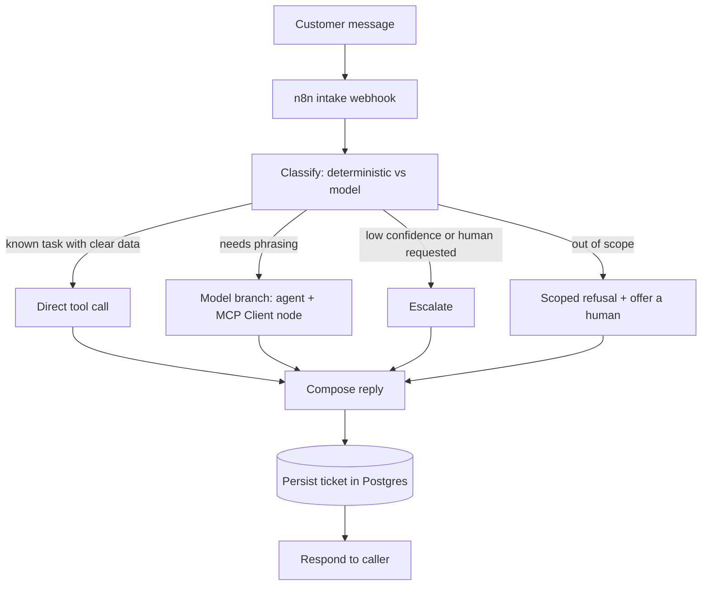

# Architecture

This kit answers customer questions for a Shopify store inside a tightly scoped
set of business tasks: order status, returns and refunds, shipping, store FAQ,
and booking. It is built so that most questions never reach a paid language
model at all, and so that anything outside the supported tasks is politely
declined instead of answered freely.

## Components

| Component | Role | Technology |
|-----------|------|------------|
| n8n | Orchestration. Receives a message, classifies it, calls tools, replies, and records the ticket. | Self-hosted n8n |
| Tool service | Deterministic business logic exposed two ways: an MCP server for the n8n MCP Client node, and a plain REST facade for direct use and tests. | Node.js + TypeScript |
| Postgres | Durable storage for tickets and the answer cache. | Postgres 16 |
| Mock Shopify adapter | Reads orders and products from local JSON so the whole kit runs offline with no store credentials. | In-process module |
| Mock LLM | Deterministic, grounded, OpenAI-compatible stand in so the kit runs offline with no API key and no paid calls. | In-process module |

Everything ships with mock adapters, so the default configuration runs with no
network access, no API keys, and no paid calls. Live store and model adapters
are not implemented in this source. Adding either integration requires code,
selection wiring, reviewed configuration, and integration tests.

## Request flow

### Classification

A deterministic classifier runs first. It detects intent from keywords and
extracts entities such as an order number or email. The outcome is a `route`:

- `deterministic`: the intent maps cleanly to store data, for example an order
  status lookup or a known FAQ. The tool service answers from data and a
  template. No model is called, so this path is effectively free.
- `model`: the message is in scope but needs natural language synthesis. The
  model is called with a strict, grounded prompt and may only use tool output.
- `escalate`: low confidence, an explicit request for a human, or a failed
  lookup. A ticket is opened and routed to a human queue.
- `out_of_scope`: the message is not one of the supported tasks. The kit
  declines and offers to connect a human, rather than acting as a general
  chatbot.

### Tools

The tool service exposes three deterministic tools and one read helper, all
backed by the mock adapters:

- `order_lookup`: order status, fulfillment, and tracking for an order id or
  email.
- `faq_retrieval`: ranked answers from the store FAQ corpus (returns, shipping,
  sizing, warranty, and similar).
- `escalate`: opens a ticket and assigns it to the configured human queue.
- `check_booking`: returns available slots for a consultation or fitting.

The same functions are reachable two ways. The n8n MCP Client node talks to the
MCP server for the model-driven branch, and the deterministic branch calls the
REST facade directly. Both call the identical underlying functions, so behavior
is consistent regardless of entry point.

### Cost control

The `model` branch checks the answer cache first. The cache key is a hash of the
normalized message and route. A hit returns the stored answer and skips the
model call entirely. Deterministic answers are also cached for consistency.
Cache entries are stored in Postgres so they survive restarts.

### Error workflow

A dedicated n8n error workflow is wired as the error handler for the intake
workflow. When any node fails, it captures the failing node name, the input
item, and the error message, and records the failure so it can be reviewed.
This keeps a broken third party call or a malformed message from silently
dropping a customer request.

## Why scoped, not a general chatbot

As of January 2026, Meta restricts general purpose AI chatbots on its
messaging platforms, while scoped assistants that handle defined business tasks
such as order status, FAQ, and booking remain allowed. This kit is built as the
scoped kind on purpose. The classifier refuses anything outside the supported
tasks, the model branch is grounded to tool output only, and there is no free
form conversation mode. That keeps the deployment compliant and also keeps it
accurate, because every answer traces back to store data.

## Configuration and secrets

Runtime configuration lives in `config.json`, which is git ignored and expected
to be `chmod 600`. A committed `config.example.json` documents every field.
Secrets are never placed in environment files and never committed. The default
config uses the mock store and mock model, so no secret is required to run the
demo.

## Data model

Two tables, defined in `sql/init.sql`:

- `tickets`: one row per inbound message, with the resolved intent, route,
  status, reply, and confidence.
- `answer_cache`: cached responses keyed by normalized message and route, with a
  hit counter for observability.
