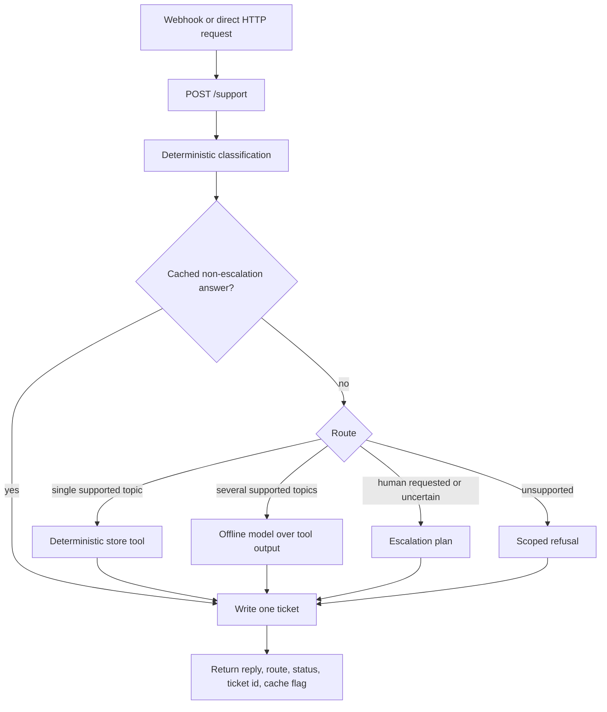

# Architecture

ecom-support-kit is an offline acceptance kit. It exercises one narrow support
pipeline against local store fixtures and records the result. It is not a help
desk, channel adapter collection, or production deployment.

## Components

| Component | Responsibility | Boundary |
|---|---|---|
| Intake workflow | Converts one webhook request into one service call | No routing or persistence logic |
| Tool service | Classifies, calls tools, composes a reply, and records one ticket | No authentication or live adapters |
| Memory store | Zero-config demo persistence for one process | Not durable |
| Database store | Durable local tickets, cache entries, and failure records | No host port in Compose |
| Mock commerce adapter | Reads orders, FAQ entries, products, and slots from JSON | Read only |
| Offline model | Combines tool output for multi-topic examples | Deterministic fixture, no network |
| Error workflow | Attempts to record failed workflow executions | No external dead-letter queue |

The service exposes the same four tools through REST and a standard tool
protocol. That protocol is an integration surface. The bundled intake workflow
calls the complete service pipeline instead of rebuilding orchestration with
visual nodes.

## Request flow



## Single composition root

Routing and ticket creation live in `service/src/pipeline.ts`. The command-line
demo, `POST /support`, and the intake workflow all execute that same function.

This is a deliberate response to drift. When route logic exists in both code
and a visual workflow, fixes must land twice and side effects can run twice. A
thin workflow prevents that class of defect.

The tradeoff is reduced visual configurability. Teams that want to change route
behavior must edit the pipeline and extend its tests.

## Routing opinion

The classifier chooses one of four routes:

- `deterministic` for one supported task with enough data
- `model` for several supported topics that need one response
- `escalate` for an explicit human request or low confidence
- `out_of_scope` for unsupported work

Deterministic routing is the default because clear lookups do not benefit from
a model call. The cost is intentionally narrow coverage and more handoffs.

## Cache and side effects

The cache key hashes the normalized message and route. A cache hit reuses the
reply but still creates a new ticket for the new inbound message.

Escalations bypass the cache because every human request is a new side effect.
All routes write exactly one ticket.

## Error contract

Expected failures use a stable code, a cause, and a next action.

CLI form:

```text
[STORE_UNAVAILABLE] Cannot initialize the ticket database. Next: Start the local database or use memory storage for the offline check.
```

HTTP form:

```json
{
  "error": "INVALID_JSON",
  "message": "The request body is not a valid JSON object.",
  "next": "Send an object with content-type application/json and retry the request."
}
```

Unknown internal exceptions are not returned to HTTP callers. They become an
`INTERNAL_ERROR` response with a log-and-retry instruction.

## Configuration order

Configuration precedence is:

1. built-in offline defaults
2. optional `config.json`
3. environment variables

Invalid JSON, invalid ports, and unsupported adapters stop startup. They do not
silently fall back to a different behavior.

## Persistence model

Three tables are defined in `sql/init.sql`:

- `tickets` stores one record per inbound message
- `answer_cache` stores reusable non-escalation responses and hit counts
- `failures` stores workflow failure context for operator review

The memory store implements the same interface for the no-container proof.

## Security and production boundary

Compose binds application ports to loopback and does not publish the database
port. The HTTP service itself has no authentication.

Before live data, add an authenticated TLS boundary, implement and test real
commerce and model adapters, define retention and access controls, add
notification delivery, and review channel and privacy obligations.

The kit does not provide an inbox, outbound channel, booking reservation,
notification handoff, compliance guarantee, or production operations model.
