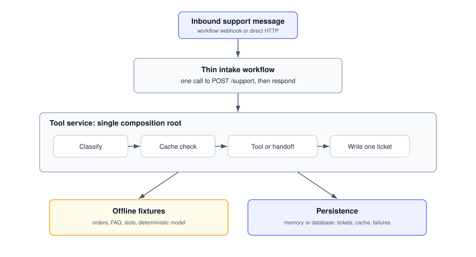
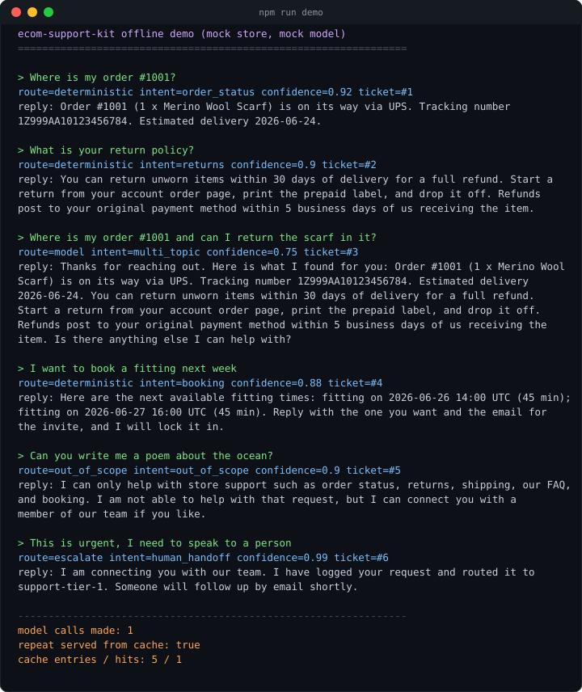

# ecom-support-kit

A self-hostable customer support reference kit for online stores. It handles
order status, returns, shipping, store FAQ, and booking, and offers a human
handoff outside that scope. It is not a general chatbot.

This repository is a working offline demo and an integration starter for teams
that want to own their support stack. It ships mock store and model adapters,
so the service pipeline can be tried with no API keys and no paid calls. Real
commerce and model-provider adapters are production integration work and are
not included here.

**Stack:** importable n8n workflows, a small Node and TypeScript tool service,
Postgres for tickets, and Docker Compose for one command startup.

## Why this beats a generic chatbot

A generic chatbot bolted onto a store tends to do three things badly: it
invents answers it cannot back up, it costs a model call on every single
message, and it happily wanders off topic. This kit is built the opposite way.

- **It stays in scope by construction.** A deterministic classifier decides
  whether a message is one of the supported tasks. Anything else is declined
  politely rather than answered freely. Platform policies and deployment
  compliance still need review for the channels and jurisdictions you use.
- **Answers trace back to store data.** The deterministic tools look up real
  orders and FAQ entries. When the model is used, it is given only tool output
  and instructed to stay inside it. That reduces hallucination risk, but a real
  model deployment still needs output validation and monitoring.
- **Clear requests never need a paid model.** A deterministic first router
  handles order lookups, FAQ, shipping, and booking with templates. The model is
  reserved for messages that need to combine several tools. The direct service
  pipeline also caches repeated answers.
- **You own it.** It is self hosted, every message becomes a ticket in your own
  Postgres, and the included error workflow can record failed orchestration runs
  after it is selected in the intake workflow settings.

## Architecture



A message arrives at the n8n intake webhook. A deterministic classifier picks
one of four routes: answer from store data with no model, synthesize an in scope
answer with the model and the MCP tools, escalate to a human, or decline because
the request is out of scope. Every path writes a ticket and replies to the
caller. The tool service exposes the same business logic two ways, an MCP server
for the model driven branch and a REST facade for the deterministic branch, both
backed by mock adapters that need no credentials. Full detail is in
[ARCHITECTURE.md](ARCHITECTURE.md).

## See it run

This is a captured run of `npm run demo` from 10 August 2026. The command sends
sample messages through the direct service pipeline offline. Bundled mock dates
are rebased on each run so orders and appointment slots stay current.



The last three lines show one mock-model call across the sample, a repeat served
from cache, and one ticket opened for each message.

## Quick start

You need Docker and Docker Compose.

```bash
git clone https://github.com/EdgeF-4/ecom-support-kit.git
cd ecom-support-kit
cp config.example.json config.json
chmod 600 config.json
docker compose up -d
```

This starts Postgres, the tool service on port 8080, and n8n on port 5678. The
default configuration uses the mock store and the mock model, so no API key is
required.

Both host ports bind to loopback. Check that all three services are healthy or
running:

```bash
docker compose ps
curl -s 127.0.0.1:8080/health
```

If either host port is already in use, choose different loopback ports:

```bash
SUPPORT_PORT=18080 N8N_PORT=15678 docker compose up -d
curl -s 127.0.0.1:18080/health
```

Send a message straight to the tool service:

```bash
curl -s 127.0.0.1:8080/support \
  -H 'content-type: application/json' \
  -d '{"message":"where is my order #1001?"}'
```

Then import the workflows into n8n at `http://localhost:5678`. See
[workflows/README.md](workflows/README.md) for the import and wiring steps,
including how to point the n8n chat model node at the offline mock.

### Run the tool service without Docker

```bash
cd service
npm ci
npm run build
npm start          # serves on 8080 with the in memory store and mock model
npm run demo       # prints the sample transcript shown above
```

## How it decides

| Route | When | Cost |
|-------|------|------|
| Deterministic | A single supported task with clear data, for example an order number or a known FAQ. | No model call. |
| Model | In scope but needs to combine tools, for example an order plus a return question. | Direct service repeats are cached. The imported workflow calls its configured model. |
| Escalate | The customer asks for a human, or confidence is low. | Opens a ticket, no model call. |
| Out of scope | Not one of the supported tasks. | Declined politely, no model call. |

## Tools and MCP

The tool service exposes four tools over an MCP server at `/mcp` and over a REST
facade at `/tools/<name>`:

- `order_lookup`: order status, fulfillment, and tracking by order number or email.
- `faq_retrieval`: ranked answers from the store FAQ corpus.
- `check_booking`: available consultation or fitting slots.
- `escalate`: opens a ticket and routes it to a human queue.

The n8n MCP Client node connects to `/mcp`, so the model driven branch discovers
and calls these tools the standard way.

## Configuration and secrets

Runtime configuration lives in `config.json`, which is git ignored and expected
to be `chmod 600`. A committed `config.example.json` documents every field.
Secret values should come from an owner-managed deployment secret store and
must not be committed. The default config runs the kit offline, so no secret is
needed to try it.

## Production boundary

The current direct service wires the bundled mock commerce and mock model
adapters only. The imported workflow can use a real model through its model
credential, but a real commerce adapter is not shipped. Escalation records a
queue assignment; notification delivery is not included.

The default host ports bind to loopback only. The tool-service routes do not
implement authentication, so do not publish port 8080 directly. Before handling
real customer data, add an authenticated TLS reverse proxy, implement and test
the real commerce and model adapters, move secrets to your deployment secret
manager, set retention and access controls for tickets and failures, and review
the applicable platform and privacy rules.

## Tests

```bash
cd service
npm test
```

The suite uses the Node built in test runner, so there is no test framework to
install. It covers the classifier routing decisions, each tool against the mock
adapters, the answer cache, an offline end to end run through every route, and
the HTTP and MCP surface on a real ephemeral port. It runs fully offline with
the in memory store, and it passes from a clean checkout.

## Project layout

```
ecom-support-kit/
  docker-compose.yml      one command startup for Postgres, the service, and n8n
  config.example.json     documented config; copy to config.json (git ignored)
  sql/init.sql            tickets, answer_cache, and failures tables
  workflows/              importable n8n intake and error workflows
  service/                Node and TypeScript tool service
    src/                  classifier, tools, mock adapters, MCP server, pipeline
    data/mock-clock.json  keeps bundled mock dates relative to the run date
    test/                 unit and offline end to end tests
  docs/                   architecture diagram and demo screenshot
  scripts/publish.sh      one step publish for the repository owner
```

## License

MIT. See [LICENSE](LICENSE).
